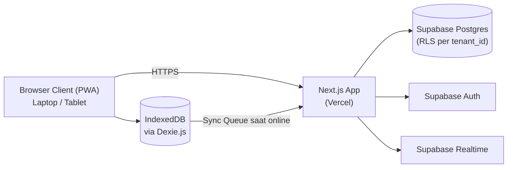

# Architecture

## System diagram

## Components

| Component | Responsibility | Ideal spec |
|---|---|---|
| Next.js App (Vercel) | Serve UI, API routes untuk sync, settlement titipan, registrasi tenant, dan proteksi otorisasi | Vercel serverless functions, auto-scale |
| Supabase Postgres | Penyimpanan data utama, multi-tenant dengan RLS berbasis `tenant_id` di setiap tabel | Tier Supabase sesuai jumlah tenant, mulai Free/Pro |
| Supabase Auth | Autentikasi & manajemen sesi user (Super Admin, Admin, Kasir) | Managed |
| Supabase Realtime | Opsional: update data lintas sesi (misal stok) saat online | Managed |
| IndexedDB (client, via Dexie.js) | Cache lokal produk & antrian transaksi offline | Browser storage, per perangkat |
| Service Worker | Caching app shell & aset statis agar aplikasi tetap terbuka saat offline | Browser |

## Environments

| Environment | Purpose | Notes |
|---|---|---|
| development | Development lokal | Supabase project terpisah, `.env.local` |
| staging | Preview sebelum rilis | Vercel Preview Deployments + Supabase project staging (opsional di awal) |
| production | Environment yang dipakai tenant sungguhan | Vercel production + Supabase project production |

## Scaling & reliability notes

- Isolasi data antar tenant wajib ditegakkan di level database (RLS), bukan hanya di level aplikasi
- Antrian sinkronisasi (sync queue) harus idempotent, memakai `local_id` yang digenerate client agar transaksi tidak terduplikasi saat retry
- Backup otomatis mengandalkan fitur backup bawaan Supabase (Point-in-Time Recovery tersedia di tier berbayar)
- Potensi bottleneck: sinkronisasi massal saat banyak tenant online bersamaan setelah offline dalam waktu lama — perlu strategi batching pada fase implementasi sync
- Navigasi antar halaman dashboard tidak boleh melakukan pengecekan auth berulang (middleware + layout masing-masing memanggil `getUser()`) — cukup satu kali per request; tiap rute dashboard sebaiknya punya `loading.tsx` agar transisi terasa instan walau data masih dimuat
- Webhook Midtrans harus idempotent (order_id sebagai kunci) dan signature-nya diverifikasi sebelum status invoice diubah — notifikasi bisa terkirim berulang kali dari sisi Midtrans
- Pembatasan akses akibat tagihan menunggak dicek di level middleware/route guard untuk rute Kasir/POS saja; rute laporan & riwayat tetap harus lolos guard tersebut agar data historis tidak ikut terkunci
