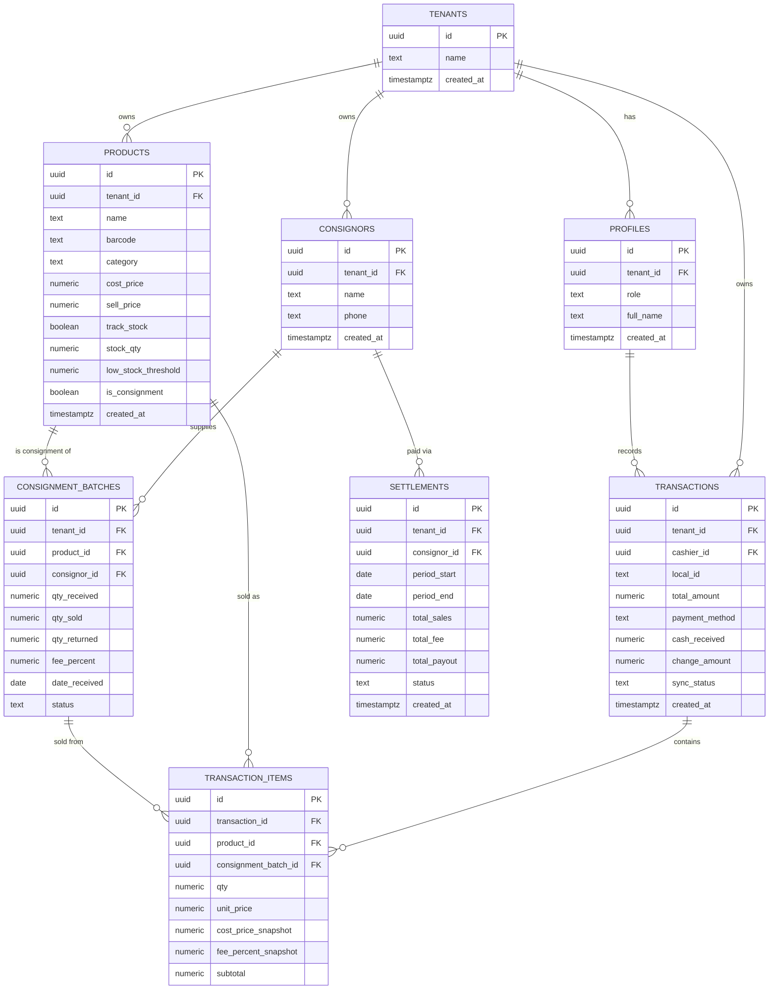

# Database Design

## ERD

## Tables

### tenants

| Column | Type | Constraints | Notes |
|---|---|---|---|
| id | uuid | PK, default gen_random_uuid() | |
| name | text | not null | Nama toko/kantin |
| created_at | timestamptz | not null, default now() | |

### profiles

| Column | Type | Constraints | Notes |
|---|---|---|---|
| id | uuid | PK, FK → auth.users.id | 1:1 dengan user Supabase Auth |
| tenant_id | uuid | FK → tenants.id, nullable | null untuk role `super_admin` |
| role | text | not null, check in (super_admin, admin, kasir) | |
| full_name | text | not null | |
| created_at | timestamptz | not null, default now() | |

### products

| Column | Type | Constraints | Notes |
|---|---|---|---|
| id | uuid | PK, default gen_random_uuid() | |
| tenant_id | uuid | FK → tenants.id, not null | RLS key |
| name | text | not null | |
| barcode | text | unique per tenant | dicari saat scan |
| category | text | nullable | |
| cost_price | numeric | not null, default 0 | harga modal |
| sell_price | numeric | not null | harga jual |
| track_stock | boolean | not null, default true | opsi jual tanpa lacak stok |
| stock_qty | numeric | not null, default 0 | diabaikan jika track_stock = false |
| low_stock_threshold | numeric | nullable | pemicu insight low stock |
| is_consignment | boolean | not null, default false | |
| created_at / updated_at | timestamptz | not null, default now() | |

### consignors

| Column | Type | Constraints | Notes |
|---|---|---|---|
| id | uuid | PK, default gen_random_uuid() | |
| tenant_id | uuid | FK → tenants.id, not null | |
| name | text | not null | |
| phone | text | nullable | |
| created_at | timestamptz | not null, default now() | |

### consignment_batches

| Column | Type | Constraints | Notes |
|---|---|---|---|
| id | uuid | PK, default gen_random_uuid() | |
| tenant_id | uuid | FK → tenants.id, not null | |
| product_id | uuid | FK → products.id, not null | |
| consignor_id | uuid | FK → consignors.id, not null | |
| qty_received | numeric | not null | jumlah barang dititip (batch harian) |
| qty_sold | numeric | not null, default 0 | |
| qty_returned | numeric | not null, default 0 | sisa yang dikembalikan ke penitip |
| fee_percent | numeric | not null, default 10 | persen fee, override per batch |
| date_received | date | not null | |
| status | text | not null, check in (active, settled, returned) | |

### transactions

| Column | Type | Constraints | Notes |
|---|---|---|---|
| id | uuid | PK, default gen_random_uuid() | |
| tenant_id | uuid | FK → tenants.id, not null | |
| cashier_id | uuid | FK → profiles.id, not null | |
| local_id | text | unique per tenant | UUID digenerate client, untuk idempotency sync offline |
| total_amount | numeric | not null | |
| payment_method | text | not null, check in (cash, qris, transfer) | |
| cash_received | numeric | nullable | hanya untuk cash |
| change_amount | numeric | nullable | hanya untuk cash |
| sync_status | text | not null, default 'synced' | synced / pending, untuk audit trail sinkronisasi |
| created_at | timestamptz | not null | timestamp transaksi dibuat di client (bukan waktu sync) |

### transaction_items

| Column | Type | Constraints | Notes |
|---|---|---|---|
| id | uuid | PK, default gen_random_uuid() | |
| transaction_id | uuid | FK → transactions.id, not null | |
| product_id | uuid | FK → products.id, nullable, `on delete set null` | null jika barang aslinya sudah dihapus; riwayat transaksi tetap ada |
| consignment_batch_id | uuid | FK → consignment_batches.id, nullable, `on delete set null` | terisi jika item barang titipan |
| qty | numeric | not null | |
| unit_price | numeric | not null | harga jual saat transaksi (snapshot) |
| cost_price_snapshot | numeric | not null | untuk hitung laba meski harga modal berubah nanti |
| fee_percent_snapshot | numeric | nullable | untuk hitung bagian penitip |
| subtotal | numeric | not null | |

### settlements

| Column | Type | Constraints | Notes |
|---|---|---|---|
| id | uuid | PK, default gen_random_uuid() | |
| tenant_id | uuid | FK → tenants.id, not null | |
| consignor_id | uuid | FK → consignors.id, not null | |
| period_start / period_end | date | not null | |
| total_sales | numeric | not null | |
| total_fee | numeric | not null | bagian toko |
| total_payout | numeric | not null | bagian penitip |
| status | text | not null, check in (draft, paid) | draft = preview, belum final |
| created_at | timestamptz | not null, default now() | |

## Migration log

<!-- Append-only. Setiap perubahan skema dicatat, ditautkan ke fitur/phase penyebabnya. -->
| Date | Change | Reason / feature | Phase |
|---|---|---|---|
| 2026-07-16 | Skema awal: tenants, profiles, products, consignors, consignment_batches, transactions, transaction_items, settlements | init | 1 |
| 2026-07-17 | `transaction_items.product_id` & `consignment_batch_id`: ubah FK jadi `on delete set null` (kolom jadi nullable) agar riwayat transaksi tetap tersimpan saat barang/batch titipan dihapus, dan cascade delete tenant tidak lagi gagal karena urutan FK (BL-1) | BL-1 | 7 |
